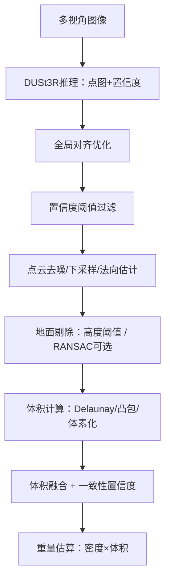

# 煤堆体积测算与钢材计数AI视觉识别项目（Demo阶段）汇报材料（汇总版）

> 说明：本Demo阶段的核心算法方法**完全参考论文**《DUSt3R: Geometric 3D Vision Made Easy》（项目内文件：[DUSt3R Geometric 3D Vision Made Easy.md](file:///mnt/data3/clip/DUSt3R/DUSt3R%20Geometric%203D%20Vision%20Made%20Easy.md)）进行工程化落地与适配；并结合项目阶段文档与现有演示系统进行汇总输出。  
> 参考材料：[项目需求文档.md](file:///mnt/data3/clip/DUSt3R/项目需求文档.md)｜[技术实施路径.md](file:///mnt/data3/clip/DUSt3R/技术实施路径.md)｜[项目技术总结与问题咨询.md](file:///mnt/data3/clip/DUSt3R/项目技术总结与问题咨询.md)｜[完成说明文档.md](file:///mnt/data3/clip/DUSt3R/完成说明文档.md)｜[煤堆点云体积测量技术文档.md](file:///mnt/data3/clip/DUSt3R/煤堆点云体积测量技术文档.md)

---

## 1. 一页摘要（给领导看的版本）

### 1.1 项目要解决的核心问题

- **业务痛点**：库存抵押监管/资产盘点需要“可信、可追溯、可视化”的煤堆体积（进而重量）估算，替代低效且存在人为风险的人工盘点。
- **落地难点**：煤堆形态不规则、现场光照/粉尘复杂、多摄像头安装后标定困难；传统三维重建流程（SfM/MVS）部署复杂且脆弱。

### 1.2 Demo阶段我们交付了什么

- **可运行演示系统**：基于Web界面的“煤堆体积测算Demo”，支持多张照片上传，输出体积/重量/置信度，并提供3D点云交互查看与结果文件下载。
- **核心能力链路打通**：多视角图像 → 3D重建点云 → 地面剔除 → 体积计算（多方法融合）→ 重量估算 → 结果可视化/导出。
- **明确边界**：当前Demo重点聚焦“煤堆体积测算”；需求文档中的“钢材计数、异常报警、趋势分析、与监管系统对接”等为后续阶段能力（见第10节规划）。

### 1.3 方案核心优势（高层表达）

- **无需相机标定即可重建**：采用DUSt3R范式，以“点图（pointmap）回归”替代传统相机几何强约束，显著降低现场部署门槛。
- **从二维到三维的一体化推理**：通过Transformer架构学习几何先验，实现从多张普通RGB图像直接获得密集3D结构。
- **工程可用的输出形态**：以点云为中间产物，便于后续接入体积计算、轮廓提取、变化检测与审计追溯。

---

## 2. 需求与Demo范围对齐

### 2.1 需求回顾（摘要）

来自：[项目需求文档.md](file:///mnt/data3/clip/DUSt3R/项目需求文档.md)

- 煤堆体积测算：三维轮廓识别、体积/重量预估、置信度评分、可视化展示。
- 钢材计数：识别钢材个体并统计根数（后续阶段）。
- 异常报警：库存突变报警（后续阶段）。
- 数据展示与接口：监控画面、3D模型、趋势曲线、对外API（后续阶段）。

### 2.2 Demo阶段实际覆盖（已实现）

对应实现主程序：[coal_volume_demo.py](file:///mnt/data3/clip/DUSt3R/coal_volume_demo.py)

- 多张图像输入（至少2张，推荐5–10张）
- DUSt3R推理与多视角全局对齐
- 置信度过滤 + 点云去噪/下采样
- 地面剔除（默认高度阈值，可选RANSAC平面拟合）
- 体积计算（三种方法并行 + 融合置信度）
- 重量估算（体积 × 密度）
- Web端交互展示：结果文本、3D模型、点云/JSON下载

### 2.3 Demo阶段明确未实现（但建议纳入后续）

- 钢材计数（建议采用检测+实例分割/计数网络，另行模块化实现）
- 视频流实时处理（Demo当前以离线图像组为主，便于快速验证可行性）
- 异常报警、趋势分析、对外API与权限审计（工程化阶段推进）

---

## 3. 总体技术方案（系统级视角）

### 3.1 系统架构总览

### 3.2 Demo技术栈摘要

- 3D重建：DUSt3R（预训练权重，输入分辨率默认512）
- 数值/几何：NumPy / SciPy（Delaunay、ConvexHull）
- 点云：Open3D（去噪、下采样、法向估计）
- 3D可视化：Trimesh导出GLB + Web端Model3D查看
- Web：Gradio（快速构建交互式演示）

---

## 4. 核心算法方法（对领导“讲清楚、讲高级”）

### 4.1 为什么选择DUSt3R（对比传统方案）

- 传统SfM/MVS（如COLMAP）：需要相机内外参与位姿估计，现场摄像头多、环境差时，**标定与特征匹配易失败**，工程链路复杂。
- DUSt3R：直接学习“从图像对到三维结构”的映射，**不依赖先验相机标定**，更适合“工业现场快速部署、快速验证”的阶段目标。

### 4.2 DUSt3R方法要点（论文范式的工程化表达）

来自论文：[DUSt3R Geometric 3D Vision Made Easy.md](file:///mnt/data3/clip/DUSt3R/DUSt3R%20Geometric%203D%20Vision%20Made%20Easy.md)

#### 4.2.1 点图（Pointmap）表征：把三维“写回”到二维像素网格

- DUSt3R将每张图像对应的场景三维结构表示为一个与图像同分辨率的3D点场：**pointmap**（点图）。
- 每个像素点都对应一个3D点坐标（在某个统一坐标系表达），从而在输出层面同时具备：
  - 像素到三维的映射（可用于深度/匹配等）
  - 两视角之间的几何一致性线索

#### 4.2.2 Transformer骨干：利用大规模预训练引入“几何先验”

- 网络由两路共享权重的ViT编码器与带交叉注意力的解码器组成：  
  - 编码器提取两幅图像的token特征  
  - 解码器通过自注意力+交叉注意力实现跨视角信息交互  
  - 回归头直接输出点图与置信度
- 工程意义：对煤堆“纹理弱、光照复杂”场景具备更强的泛化鲁棒性，是传统基于局部特征点的方案难以做到的。

#### 4.2.3 多视角全局对齐（Global Alignment）：把多对点图拉到同一三维世界

- 单次推理处理的是“图像对”；当输入多张图像时，需要把多对预测结果在同一坐标系中对齐。
- DUSt3R提供一种不依赖重投影误差的全局优化：直接最小化3D空间中的一致性误差，并通过图结构初始化（最大生成树传播初值）提升收敛稳定性。
- 对应Demo实现：  
  - 图像对生成采用“complete graph”（完全图像对）  
  - 通过`global_aligner(..., mode=PointCloudOptimizer)`进行全局对齐，并迭代优化（Demo参数：MST初始化 + 300次迭代）

### 4.3 我们的体积测算工程链路（从点云到体积）

对应实现：[coal_volume_demo.py](file:///mnt/data3/clip/DUSt3R/coal_volume_demo.py)

#### 4.3.1 点云质量控制：用置信度“守住下限”

- DUSt3R输出每个像素的置信度，用于过滤低可信点，避免噪声扩散到体积计算。
- 后处理采用统计离群点剔除与体素下采样，兼顾稳定性与速度。

#### 4.3.2 地面作为“体积基准面”：先定义零高度

- 工业现场煤堆体积本质上是“煤堆上方体积相对于地面基准”的积分。
- Demo提供两种地面处理策略：
  - 默认：高度分位数估计地面高度 + 阈值剔除（速度快、工程稳定）
  - 可选：RANSAC拟合地面平面（适合地面倾斜或噪声较大时）

#### 4.3.3 体积计算：三方法并行，避免单方法脆弱

- Delaunay三角剖分：在点云+地面网格点上构建四面体并累加体积，表达能力强但对噪声敏感。
- 凸包（Convex Hull）：速度快但对不规则煤堆易高估（凸包“包住空洞”）。
- 体素化：鲁棒但受体素分辨率影响，需要在速度与精度之间取舍。
- Demo策略：对有效体积做平均，并以“方法间一致性”生成置信度评分（越一致越可信）。

### 4.4 关键边界条件：尺度（Scale）问题必须显式管理

来自项目总结：[项目技术总结与问题咨询.md](file:///mnt/data3/clip/DUSt3R/项目技术总结与问题咨询.md)

- DUSt3R在无标定条件下通常得到的是**相对尺度**三维结构；体积/重量要达到“可用于监管”的量级，需要**绝对尺度恢复**。
- Demo当前采用的现实可行路线：
  - 推荐：放置已知尺寸参考物体（如1m标尺），用其在点云中的长度恢复尺度因子，体积按尺度因子的立方缩放。
  - 备选：利用拍摄距离/焦距等信息做近似尺度估计（误差更大，适合作为兜底）。

> 建议（合理修改点）：在Web界面中增加“尺度标定交互”，允许用户输入“参考物真实长度 + 在图中标注两点”，系统自动计算尺度因子并给出“真实体积/重量”，把关键风险点产品化封装，降低使用门槛。

---

## 5. Demo演示界面说明（讲得清楚、拍得好看）

对应实现：[coal_volume_demo.py](file:///mnt/data3/clip/DUSt3R/coal_volume_demo.py)

### 5.1 页面信息架构（你要怎么讲）

- **左侧主工作区**：上传图像 → 参数设置 → 一键处理 → 结果总览 → 3D模型查看 → 文件导出
- **右侧辅助说明区**：拍摄规范、参数含义、结果解释、注意事项、系统特点

### 5.2 结果展示内容（领导最关心的四件事）

- 业务结果：体积（m³）、重量（t）
- 可信度：一致性置信度（用于解释“结果是否可采信”）
- 证据链：输出点云（PLY）+ 结果JSON（可落库可审计）
- 可视化：3D点云GLB可交互查看（旋转/缩放/平移）

---

## 6. 建议在汇报中必须展示的图片清单（高大上、且有说服力）

> 原则：每张图都要能回答一个“领导关心的问题”：是不是能用？靠谱不？怎么用？以后能不能扩？投入产出如何？

### 6.1 必选图片（建议放在PPT主线）

1. **系统总体架构图**（建议用简洁的“采集-推理-结果-对接”四段式）  
   - 可直接采用第3.1节的Mermaid图重新绘制为PPT风格图。
2. **算法处理流程图**（输入→重建→点云→体积→输出）  
   - 可直接采用第4.3节的Mermaid图。
3. **Demo首页截图**（体现“产品形态成熟度”）  
   - 截图内容：标题、上传区、参数区、处理按钮、右侧说明。
4. **3D点云可视化截图**（体现“看得见的三维结果”）  
   - 截图内容：煤堆点云 + 坐标轴 + 可视化窗口。
5. **结果面板截图**（体现“业务指标一目了然”）  
   - 截图内容：体积、重量、置信度、耗时、输出目录。
6. **输出文件与可追溯性截图**（体现“可审计、可落库”）  
   - 截图内容：`output_YYYYMMDD_HHMMSS/`目录 + `result.json`内容片段。

### 6.2 可选图片（用于加分/应对追问）

- **输入图像组示例**：展示“多角度+重叠度”的正确采集方式（2×3宫格）。
- **失败案例对比**：如“渲染截图不可用” vs “真实拍摄可用”，体现工程边界与风险管理（来自项目总结文档的结论）。
- **速度与资源截图**：GPU型号/显存、单次处理耗时（用于解释可部署性）。
- **误差验证设计图**：如何做标定与精度评估（对下一阶段计划更有说服力）。

### 6.3 图片如何获取（落地操作）

- Demo启动后（参考：[README_QUICK.md](file:///mnt/data3/clip/DUSt3R/README_QUICK.md)），在浏览器打开 `http://localhost:7868`：
  - 截图A：页面初始态（未上传）
  - 截图B：上传后、处理完成态（含结果与3D模型）
  - 截图C：下载区域 + 输出目录（文件管理器/终端均可）

> 建议统一规范：截图分辨率≥1920×1080；每张图加简短标题（10字以内）；必要时对关键数字做高亮框选。

---

## 7. Demo验证结果（现状与结论）

来自：[项目技术总结与问题咨询.md](file:///mnt/data3/clip/DUSt3R/项目技术总结与问题咨询.md)

| 场景 | 输入图像 | 点云规模 | 耗时 | 结果 |
|---|---:|---:|---:|---|
| 真实煤堆照片 | 9张 | ~5000点 | ~30s | 成功 |
| 3D模型渲染截图 | 9张 | 0点 | ~30s | 失败（置信度极低） |

结论（建议汇报口径）：

- **可行性已验证**：对真实拍摄数据可以稳定输出三维点云与体积估算结果，Demo链路完整。
- **边界已明确**：非真实摄影成像（渲染截图、过度后期、缺乏视差/真实光照变化）不适用，需要在产品侧做输入质量提示与约束。

---

## 8. 当前问题与风险（以及我们的应对策略）

### 8.1 P0：尺度标定的自动化（最关键）

- 风险：相对尺度导致“体积/重量”无法直接作为监管量化指标。
- 应对：
  - 现场规范：放置参考物（1m标尺/已知尺寸标牌/地面标定点）。
  - 产品化：提供“参考物标注+自动换算”能力；并输出“标定状态”字段（已标定/未标定）。
  - 中长期：引入可选硬件（双目/RGB-D/LiDAR）或利用固定场景几何先验做半自动标定。

### 8.2 P0：精度验证体系（没有标准就无法验收）

- 风险：缺少ground truth，无法给出误差边界与可接受范围。
- 应对：
  - 设计对照实验：用已知体积容器/已知重量装车记录/激光测量做抽样对标。
  - 输出置信度与质量指标：点云数量、方法一致性、重建覆盖率，作为“可采信”依据。

### 8.3 P1：鲁棒性与实时性

- 风险：现场粉尘、逆光、遮挡导致点云质量波动；多相机/视频流会引入性能压力。
- 应对：
  - 数据采集规范与输入质量检测（清晰度/重叠度/曝光）。
  - 计算优化：减少图像对、分辨率策略、增量更新（只处理变化区域）。

---

## 9. 里程碑进展（对照需求的“项目管理语言”）

- 已完成：Demo可运行、算法链路打通、Web界面具备演示价值、输出文件可追溯。
- 正在推进：尺度标定策略固化、点云轮廓提取/俯视投影、精度验证实验设计。
- 需要资源：现场数据（多批次、多光照、多煤种）与少量标定数据（用于误差评估与后续微调）。

---

## 10. 下一阶段计划（建议按“可交付物”说）

### 10.1 第一阶段上线目标（按需求文档口径）

- 多摄像头接入与实时画面展示（工程侧）
- 煤堆轮廓识别与体积/重量预估（算法侧）
- 异常变动检测与告警（业务侧）

### 10.2 二阶段优化目标（精度、可用性、对接）

- 尺度标定半自动化/自动化能力落地（产品与算法联合）
- 精度验证体系与持续学习机制（数据闭环）
- 与监管/ERP系统对接：API、权限、审计、报表、趋势曲线

### 10.3 钢材计数（独立模块化建议）

- 建议拆分为独立子模块：检测/实例分割 + 计数聚合 + 区域统计 + 可视化标注。
- 与煤堆体积测算共享同一套“数据可信与审计”工程底座（存证、日志、权限、接口）。

---

## 11. 附录：演示与代码定位（便于现场答疑）

- Demo主程序：[coal_volume_demo.py](file:///mnt/data3/clip/DUSt3R/coal_volume_demo.py)
- 快速启动说明：[README_QUICK.md](file:///mnt/data3/clip/DUSt3R/README_QUICK.md)
- 方法论依据（论文）：[DUSt3R Geometric 3D Vision Made Easy.md](file:///mnt/data3/clip/DUSt3R/DUSt3R%20Geometric%203D%20Vision%20Made%20Easy.md)

（建议在PPT“备份页”放上启动命令与访问地址，现场演示更稳）

